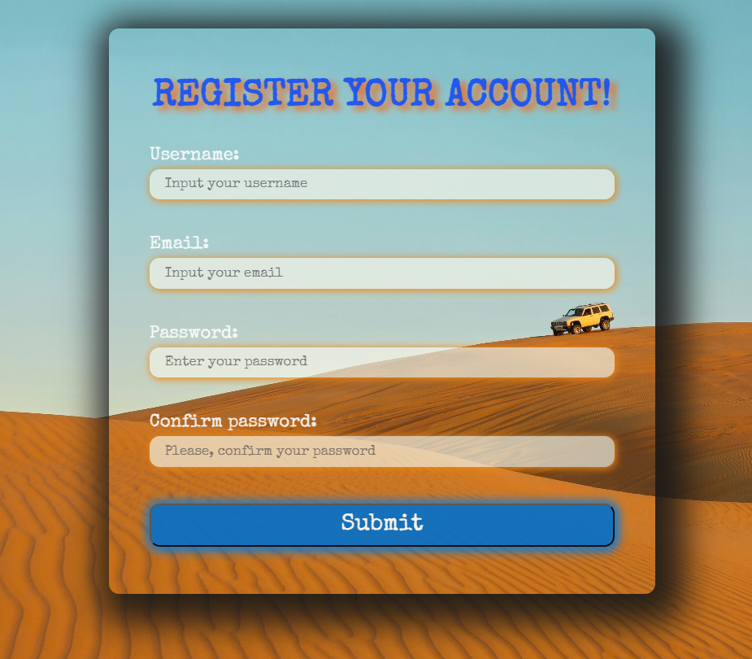

# Form Validation Project

This project demonstrates simple form validation using JavaScript. The goal is to showcase basic techniques for validating user input in forms using HTML, CSS, and JavaScript.

## LINK: https://loginforma11-11.netlify.app/

## Features

- **Input Validation:**

  - Check if required fields are filled out.
  - Validate email addresses according to standard format.
  - Verify minimum and maximum character count for passwords.
  - Confirm password matching (e.g., during account creation).

- **Dynamic Error Display:**

  - Errors are shown immediately below the relevant fields in the form.
  - Users receive feedback on what needs to be corrected.

- **CSS Styling:**

  - Fields with errors are highlighted with a red border.
  - Successfully filled fields have a green indicator.

## Technologies Used

- **HTML**: For structuring the form and input fields.
- **CSS**: For styling the form, including validation indicators.
- **JavaScript**: For dynamic form validation and error display.

## Project Structure

- **index.html**: Contains the form and basic page structure.
- **style.css**: Defines styles for the form and visual validation indicators.
- **script.js**: Contains the logic for real-time form validation.

